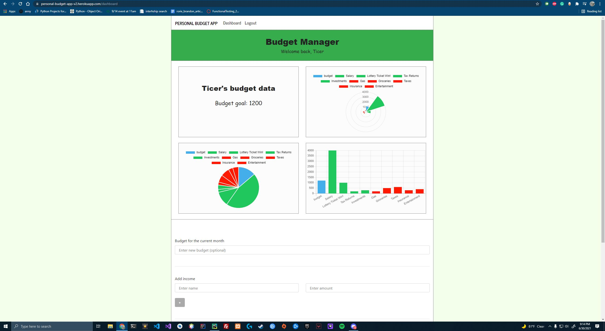

# Personal Budget Management App

A personal budget management web application. Users can create an account for free.

Click <a href="https://personal-budget-app-v2.herokuapp.com/">here</a> to visit the website.

## Tech stack 

- The frontend was built using the EJS (Embedded JavaScript) library and bootstrap. 

- The backend was built using NodeJS and the server is configured with the express backend framework.

- Mongoose was used to build the database. 

- Used Heroku to host the application. 

## Images

