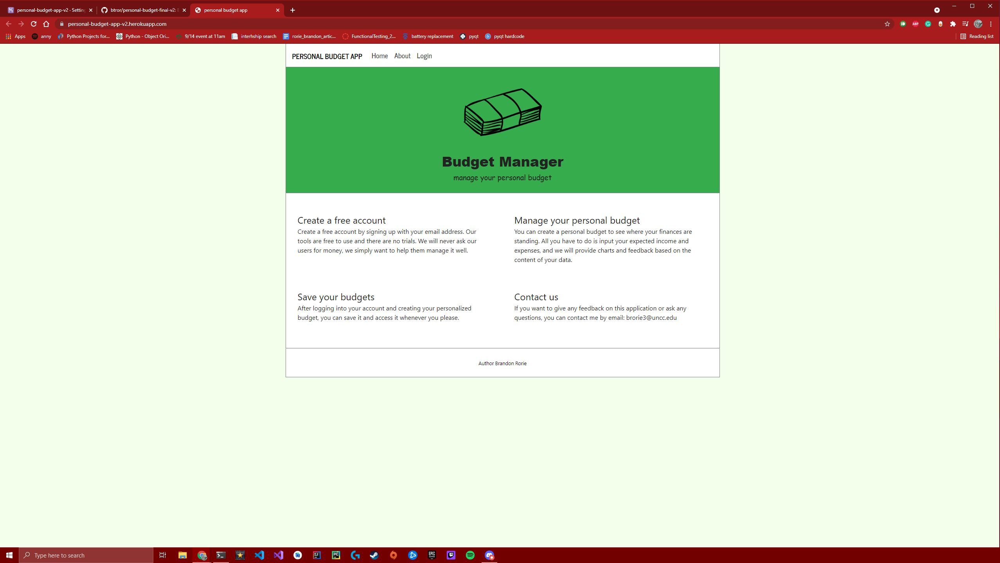
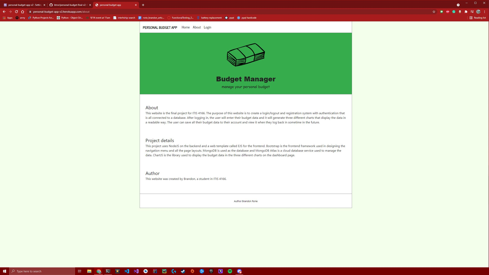
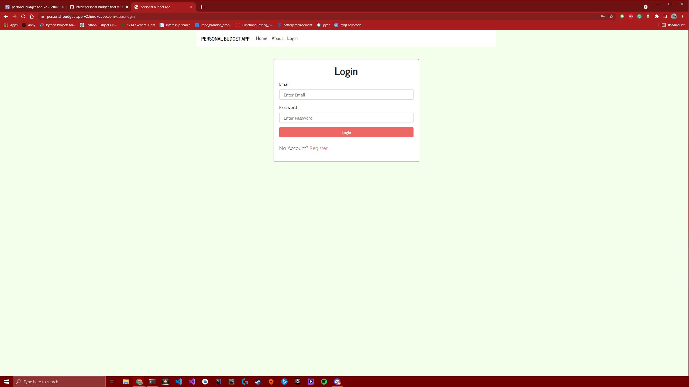
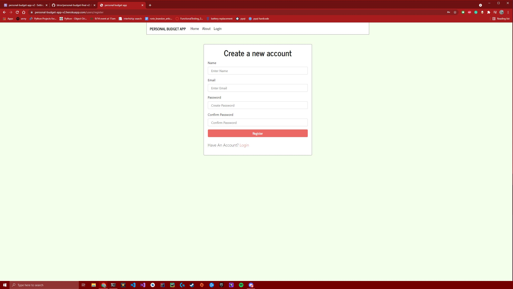
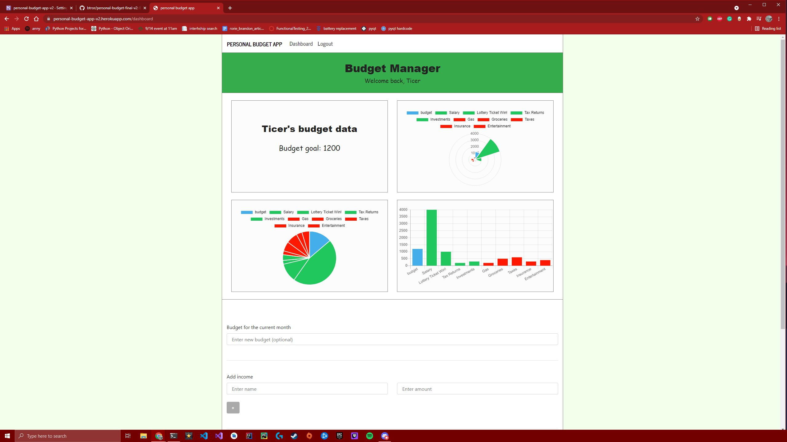
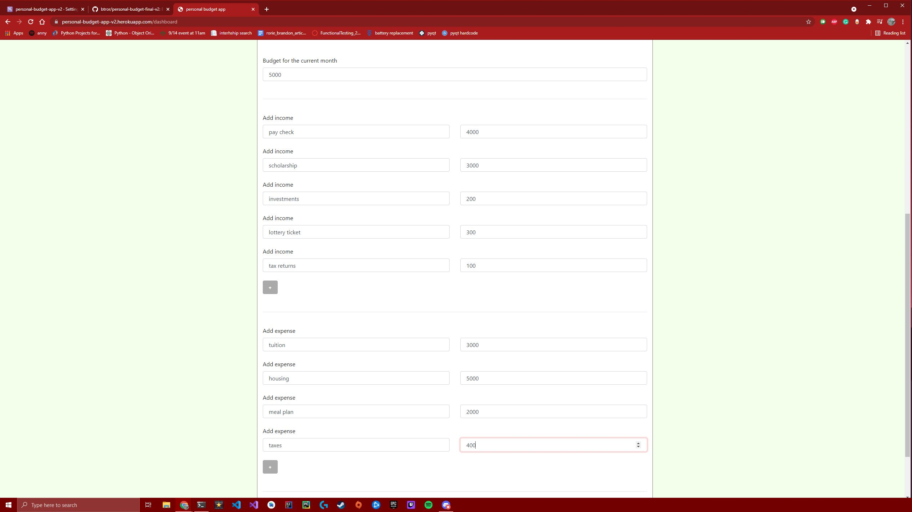
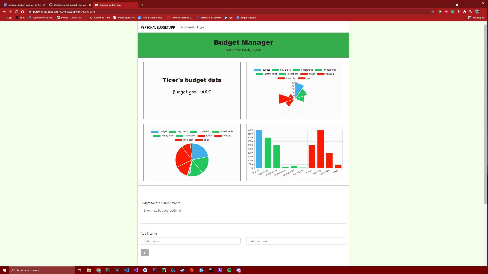

# Personal Budget Management App

A personal budget management web application. Users can create an account for free.

(Heroku only gives half a month of free hosting, so if it doesn't load it's because I don't have any more free dynos)

## Tech stack 

- The frontend was built using the EJS (Embedded JavaScript) library and bootstrap. 

- The backend was built using NodeJS and the server is configured with the express backend framework.

- Mongoose was used to build the database. 

- Used Heroku to host the application. 

## Screenshots

Home page - design

About page - design

Login page - users can login to an existing account or choose to signup

Create account page - users can signup with a valid email address and password, data saved to database

Dashboard page - loads saved budget data from database on login

Enter budget data prompts

Update dashboard page after submitting new data to the database

